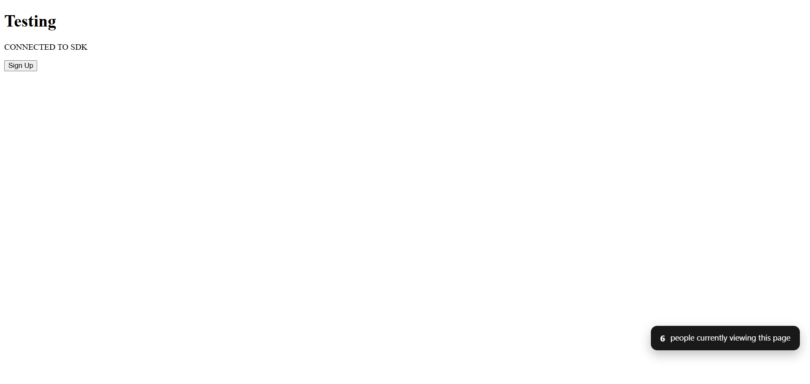
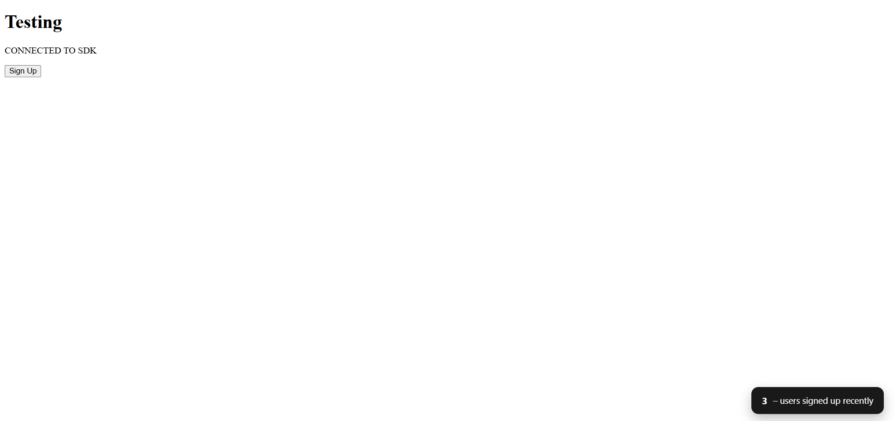

# 🔌 TrustNet – Real-Time Social Proof SDK

**TrustNet** is a backend-powered JavaScript SDK that adds **real-time social proof widgets** to your website. It boosts trust and conversion by showing **live viewer counts** and **total signups**, dynamically fetched and updated through WebSocket and HTTP.

Embed the widget on any website with just a `<script>` tag — no frontend framework required.

---

## ✨ Features

- 📡 **Live Viewer Count** via WebSockets  
- 📝 **Signup Tracking** via REST API  
- 📦 **Single JavaScript SDK** to embed anywhere  
- 🧠 Custom messages and color styling  
- 🧲 Real-time engagement widgets  
- ⏳ Auto-dismiss feature for widgets  
- 🔒 Built with full backend control – nothing is exposed to the frontend

---

## 🧪 Testing the SDK

A **test page** is available at: `/testing/test.html`

### 🛠 Tech Stack

- ⚙️ **Node.js** + **Express**  
- 🧰 **MongoDB** for tracking views/signups  
- 🖼 **EJS** templating  
- 🔌 **WebSockets** for real-time updates

---

## 🚀 Getting Started

### 1. Clone the Repository

```bash
git clone https://github.com/your-username/trustnet-social-proof.git
cd TrustNet
````

### 2. Install Dependencies

```bash
npm install
```

### 3. Set Up Environment

Create a `.env` file in the root directory and add:

```env
PORT=3000
MONGO_URI=your_mongodb_connection_string
```

### 4. Run the App

```bash
npm start
```

The app will be available at [http://localhost:3000](http://localhost:3000)

---

## 💻 Usage Example

Paste the following script tag into any website you want to track:

```html
<script 
  src="http://localhost:3000/sdk.js"
  data-client-id="zoro-ttR5tSSYV"
  data-message="120 people signed up this week!"
  data-type="both"
  data-position="top-left"
  data-color="#000000"
  data-auto-dismiss="true">
</script>
```

---

## ⚙️ Configuration Options

| Attribute           | Description                               | Default          |
| ------------------- | ----------------------------------------- | ---------------- |
| `data-client-id`    | Unique client ID to track events per site | **Required**     |
| `data-message`      | Custom message for signup widget          | `"Join others!"` |
| `data-type`         | Widget type: `signup`, `live`, or `both`  | `both`           |
| `data-position`     | Position: `top-left`, `top-right`, etc.   | `bottom-right`   |
| `data-color`        | Background color of widget (hex code)     | `#4CAF50`        |
| `data-auto-dismiss` | Auto-hide widget after 30 seconds         | `true`           |

---

## 📡 Tracking Signups via JavaScript

Use this method to trigger signup tracking manually:

```javascript
// On signup button click
document.getElementById("signupButton").addEventListener("click", function () {
  const metadata = {
    source: "website",
    campaign: "summer_sale"
  };

  if (window.Proof && window.Proof.trackSignup) {
    window.Proof.trackSignup(metadata);
    alert("Signup tracked!");
  }
});
```

---

## 🚧 Future Improvements

* 📊 Analytics dashboard (work in progress)
* 🧭 Support for tracking across multiple pages in the same website

---

## 🧠 How It Works

* The SDK connects to your backend via **WebSocket and HTTP**
* Tracks **page views** and **signups** using `client_id`
* Displays widgets dynamically with **real-time updates**

---

## Working Screenshots





